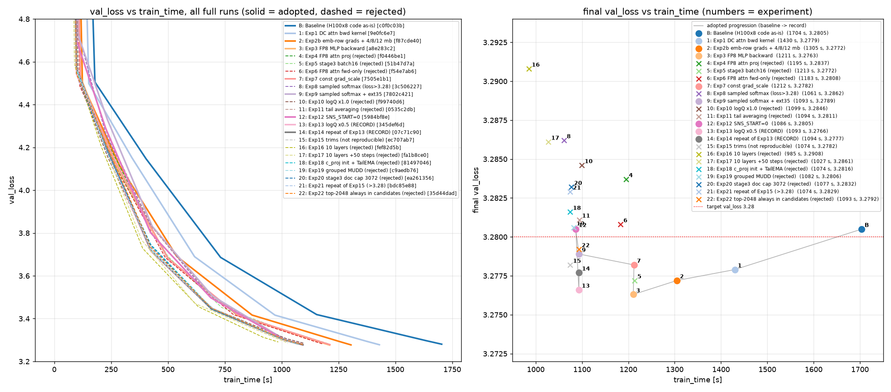

# NanoGPT speedrun on 1x RTX 5090

A fork of [KellerJordan/modded-nanogpt](https://github.com/KellerJordan/modded-nanogpt) (the *NanoGPT speedrun*), retargeted from **8x H100** to **a single RTX 5090** (32 GB, sm_120).

The task is unchanged: train a language model until it reaches **`val_loss <= 3.28`** cross-entropy on the FineWeb validation set, as fast as possible. Only the hardware — and therefore the set of optimizations that pay off — is different.

The optimization work in this branch (`rtx5090x1`) was carried out as an **autoresearch** experiment: Claude Code ran the edit → train → measure → keep-or-revert loop autonomously, recording every experiment in [`docs/research_note.md`](../docs/research_note.md) (Japanese). This README is an English summary of that note.

## Result

**Baseline 1703.7 s → record 1093.1 s (−35.8%)**, at `val_loss` 3.2766 / 3.2777 across two runs. The validation computation and data are **identical to the baseline** — only the training path was changed.



Left: `val_loss` (every 250 steps) of every full run plotted against `train_time` (solid = accepted, dashed = rejected). Right: the final point of each run (numbers = experiment IDs, grey line = the accepted lineage).

| Date | train_time | val_loss | Change |
|---|---|---|---|
| 2026-09-02 | 1703.7 s | 3.2805 | baseline (the H100x8 code run as-is on 1x RTX 5090) |
| 2026-09-02 | 1429.8 s | 3.2779 | Exp 1: DC attention backward kernel rewrite (−16.1%) |
| 2026-09-03 | 1304.9 s | 3.2772 | Exp 2b: embedding row gradients + micro-batch 4/8/12 + MLP kernel config (−8.7%) |
| 2026-09-03 | 1210.5 s | 3.2763 | Exp 3: FP8 MLP backward (−7.2%) |
| 2026-09-03 | 1093.3 s | 3.2789 | Exp 9: sampled-softmax training loss (port of upstream PR #360) + 35 extension steps (−9.8%) |
| 2026-09-03 | **1093.1 s** | **3.2766 / 3.2777** | Exp 13/14: partial log-Q correction (x0.5). **Current record configuration** (both runs below 3.28, −35.8% vs baseline) |

## What worked (in chronological order)

| Change | train_time | Kind |
|---|---|---|
| Rewrite of the DC attention backward Triton kernel (eliminating register spills) | 1703.7 → 1429.8 s | kernel |
| Row-wise embedding gradients + micro-batch 4/8/12 + MLP kernel tiling | → 1304.9 s | memory bandwidth / launch count |
| FP8 MLP backward (e5m2 gradients, dynamic scaling) | → 1210.5 s | precision / GEMM |
| Sampled-softmax training loss (port of PR #360) + partial log-Q correction x0.5 + extension steps | → 1093.1 s | algorithmic (lm_head cost) |

The single biggest win was not an algorithmic idea at all: the H100-tuned Triton kernel for the Lightweight Dynamically Composable attention backward pass kept six (16x128) probability tiles and 128x128 K/V/dV tiles alive at once, so ptxas gave up and spilled 54 KB/thread. Splitting the key window into SUB_K=64 sub-blocks (identical math, identical output contract) took the fwd+bwd microbenchmark at T=16384 from 13.8 ms to 0.91 ms.

## What did not work (rejected)

FP8 attention projections (both fwd+bwd and forward-only), FlashAttention-4 / FlexAttention, a fused quantization kernel and delayed scaling (inductor already fuses the amax pass), torch 2.11, inductor autotuning, row-chunked cross-entropy, a smaller stage-3 batch (16 units), full log-Q correction, tail averaging / TailEMA, dropping a layer (10 layers), grouped MUDD, a 3072 stage-3 document cap, always including high-frequency tokens as sampled-softmax candidates, and a further trim of the record configuration (which did not reproduce).

## Lessons learned

- **The GPU is saturated on the RTX 5090**, so kernel efficiency is everything: the CPU-side launch queue reports "Command Buffer Full", and cuBLAS bf16/fp8 GEMMs already sit near the roofline (bf16 200–227 TFLOPS, fp8 400–450 TFLOPS measured). Triton kernels tuned for the H100 can be catastrophically slow here due to register spilling — **always check `n_spills`**.
- **torch.compile pitfalls**: values derived from a buffer that is updated in-place during forward get *recomputed* in backward (take the snapshot outside `compile`); fp32→fp8 casts do not saturate under compile (clamp before casting); `tl.trans` plus a double store can miscompile.
- **Sampled softmax** cuts wall-clock by ~13% but biases the training gradient. Full log-Q correction over-corrects (the x14 negative-sample weights add variance that hurts the endgame); **half the correction is best**. Final-`val_loss` run-to-run noise is ~0.001, so any configuration within 0.002 of 3.28 must be confirmed by a rerun (Exp 15 did not reproduce).
- **Unmerged upstream PRs are a great source of ideas**, but their 8xH100 assumptions (a huge hashed n-gram table, a patched FA3) simply do not port to a single 32 GB GPU.

## Environment

- RTX 5090 (170 SM, 32 GB, 99 KB smem/block), driver 610.57, torch 2.10.0+cu128, triton 3.6.0, cuDNN 9.10
- FlashAttention-3 does not support sm_120 → falls back to `kernels-community/flash-attn2`
- `grad_accum_steps = 16` (micro-batches of 8192 → 16384 → 24576 tokens), peak memory ~24 GB

## Reproducing

```bash
pip install -r requirements.txt   # or: uv sync
python data/cached_fineweb10B.py 9
./run.sh                          # the defaults are the record configuration
```

Logs are written to `logs/<uuid>.txt`. To regenerate the plot: `python docs/plot_runs.py` (requires matplotlib).

## More

- [`docs/research_note.md`](../docs/research_note.md) — the full experiment log, including every rejected idea and why (Japanese)
- [`autoresearch.md`](../autoresearch.md) — the instructions given to the autonomous research loop (Japanese)
- [`README.md`](../README.md) — the upstream modded-nanogpt README (kept as-is)
